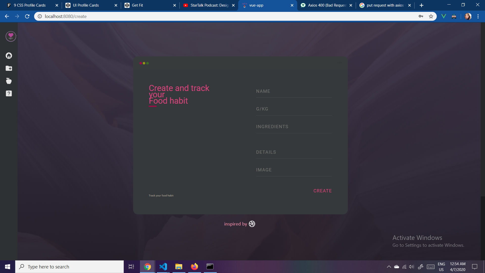
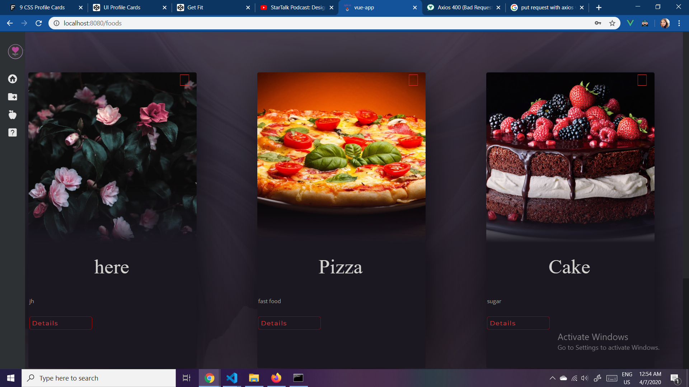
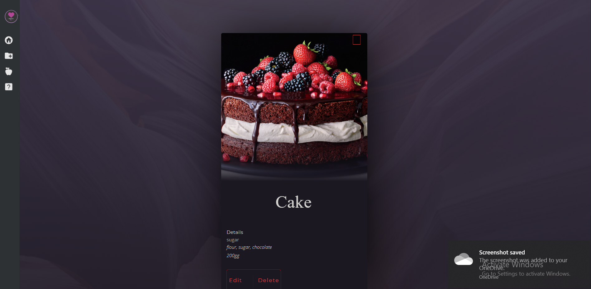

# Project setup
* npm install   
# Compiles
* npm run serve
# Private page

# Creating daily food page

# Displaying food page

# Meal details

# Aim
* The app is abount tracking your daily movements, food habits and todo tasks